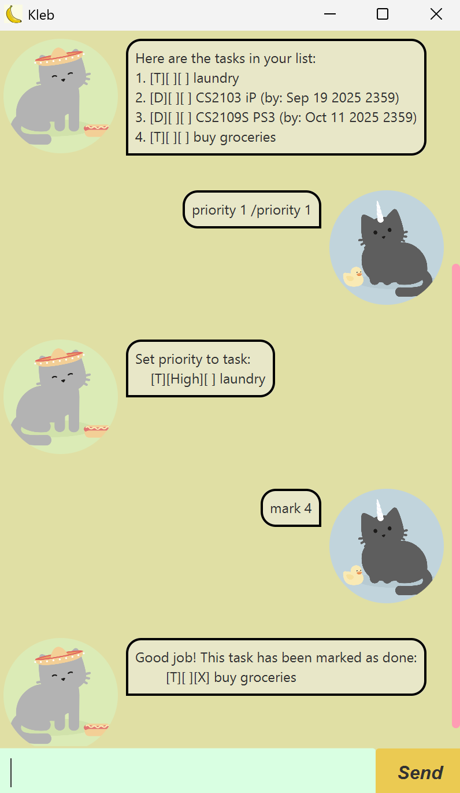

# Kleb User Guide

## Contents

1. [Getting Started](#getting-started)
2. [Features](#features)
   - [Adding Tasks](#adding-tasks)
   - [Managing Tasks](#managing-tasks)
   - [Exiting the Application](#exiting-the-application)
3. [Command Summary](#command-summary)



Kleb is your best companion to help manage your daily tasks!!

---

## Getting Started

1. Ensure Java 17 is installed on your computer.
2. Download `kleb.jar` from the latest release.
3. Navigate to the folder containing `kleb.jar` in a command line terminal, and enter the following command:
    ```
    java -jar kleb.jar
    ```
4. The application GUI should appear in a few seconds.
5. Enter the desired commands into the command box.
6. Refer to the features below for details of each command.

---

## Features

### Adding Tasks

#### 1. To-Do Tasks

A simple task with just a description.

**Command:** `todo <description>`

**Example:** `todo buy groceries`

**Expected Output:**
```
Added a task to your list:
    [T][ ][ ] buy groceries
Now you have 1 task(s) in the list.
```

---

#### 2. Deadline Tasks

A task to be completed before a specified date and time.

**Command:** `deadline <description> /by <datetime>`

**DateTime Format:** `yyyy-MM-dd HHmm` (e.g., 2025-09-25 1700)

**Example:** `deadline CS2103 iP /by 2025-09-19 2359`

**Expected Output:**
```
Added a task to your list:
    [D][ ][ ] CS2103 iP (by: Sep 19 2025 2359)
Now you have 2 task(s) in the list.
```

---

#### 3. Event Tasks

A task that occurs during a specified period.

**Command:** `event <description> /from <start-datetime> /to <end-datetime>`

**DateTime Format:** `yyyy-MM-dd HHmm` (e.g., 2025-09-25 1700)

**Example:** `event meeting /from 2025-09-20 1000 /to 2025-09-20 1100`

**Expected Output:**
```
Added a task to your list:
    [E][ ][ ] meeting (from: Sep 20 2025 1000 to: Sep 20 2025 1100)
Now you have 3 task(s) in the list.
```

---

### Managing Tasks

#### 1. View All Tasks

Displays all tasks in the list and their statuses.

**Command:** `list`

**Expected Output:**
```
Here are the tasks in your list:
    1. [T][ ][ ] buy groceries
    2. [D][ ][ ] CS2103 iP (by: Sep 19 2025 2359)
    3. [E][ ][ ] meeting (from: Sep 20 2025 1000 to: Sep 20 2025 1100)
```

---

#### 2. Mark Task as Done

Marks a task as completed.

**Command:** `mark <task-number>`

**Example:** `mark 1`

**Expected Output:**
```
Good job! This task has been marked as done:
    [T][ ][X] buy groceries
```

---

#### 3. Mark Task as Undone

Marks a task as not completed.

**Command:** `unmark <task-number>`

**Example:** `unmark 1`

**Expected Output:**
```
Okay! This task has been marked as undone:
    [T][ ][ ] buy groceries
```

---

#### 4. Delete Task

Removes a task from the list.

**Command:** `delete <task-number>`

**Example:** `delete 1`

**Expected Output:**
```
Poof! This task has been deleted:
    [T][ ][ ] buy groceries
```

---

#### 5. Find Tasks by Keyword

Finds all tasks containing a specified keyword.

**Command:** `find <keyword>`

**Example:** `find CS`

**Expected Output:**
```
Here are the matching tasks in your list:
1. [D][ ][ ] CS2103 iP (by: Sep 19 2025 2359)
```

---

#### 6. Set Priority to Task

Assigns a priority level to a task. The priority level `0` removes the set priority.

**Command:** `priority <task-number> /priority <priority-level>`

**Values for Priority-Level:** `1`: High, `2`: Medium, `3`: Low, `0`: None

**Example:** `priority 1 /priority 1`

**Expected Output:**
```
Set priority to task:
    [D][High][ ] CS2103 iP (by: Sep 19 2025 2359)
```

---

### Exiting the Application

#### Goodbye

Saves task list and exits the application.

**Command:** `bye`

**Expected Output:**
```
Bye. Hope to see you again soon!
```

The application will close after the message is displayed.

---

## Command Summary

| Action            | Format & Example                                                                                                               |
|-------------------|--------------------------------------------------------------------------------------------------------------------------------|
| Add ToDo          | `todo <description>`<br>e.g., `todo buy groceries`                                                                             |
| Add Deadline      | `deadline <description> /by <yyyy-MM-dd HHmm>`<br>e.g., `deadline CS2103 iP /by 2025-09-19 2359`                               |
| Add Event         | `event <description> /from <yyyy-MM-dd HHmm> /to <yyyy-MM-dd HHmm>`<br>e.g., `event meeting /from 2025-09-20 1000 /to 2025-09-20 1100` |
| List Tasks        | `list`                                                                                                                         |
| Mark Task as Done | `mark <task-number>`<br>e.g., `mark 1`                                                                                         |
| Unmark Task       | `unmark <task-number>`<br>e.g., `unmark 1`                                                                                     |
| Delete Task       | `delete <task-number>`<br>e.g., `delete 1`                                                                                     |
| Find Tasks        | `find <keyword>`<br>e.g., `find CS`                                                                                            |
| Set Priority      | `priority <task-number> /priority [1/2/3/0]`<br>e.g., `priority 1 /priority 1`
| Exit              | `bye`                                                                                                                          |